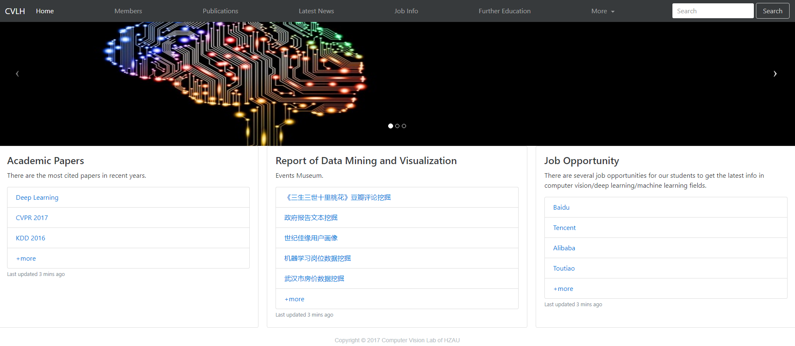
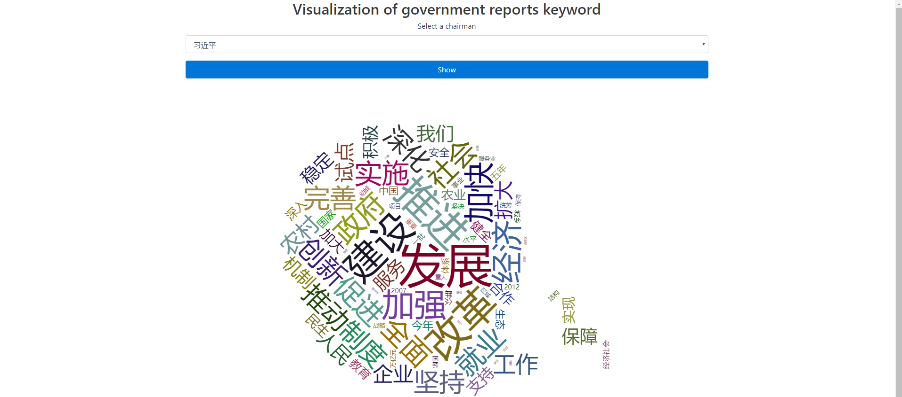

# Computer Vision Lab of HAZU - Back End

## Introduction 

   This repository is designed for later research in Computer Vision, Machine Learning, Data Mining. It includes web spider, RESTful back-end API and so on.
   
   
   
     
## Prerequisite
    
   To make use of this repository, you should have several softwares installed on your machine.
   1. JDK1.8 or higer
   2. [deeplearning4j](https://deeplearning4j.org/)
   3. Python3.X is required(Python3.5 or 3.6 is recommended)
   4. Maven support
   5. MySQL should be 5.7 or higher
   6. Tomcat 8 or higher (Ngix will also be fine)
   7. In order to handle with captcha, you should have [tessdata](https://github.com/tesseract-ocr/tessdata) directory in your project

## Third Party Library
    
   To make this repo works normally, you'd better have several 3rd party library installed on your machine
   1. [BeautifulSoup4](https://www.crummy.com/software/BeautifulSoup/bs4/doc/index.zh.html)
   2. [requests](http://www.python-requests.org/en/master/)
   3. [jieba](https://github.com/fxsjy/jieba/)
   
## Note 

   For later research, [TensorFlow](https://www.tensorflow.org/) is required, so you'd better have [CUDA](https://developer.nvidia.com/cuda-downloads), 
   [cuDNN](https://developer.nvidia.com/cudnn) and [TensorFlow](https://www.tensorflow.org/) installed on your machine.