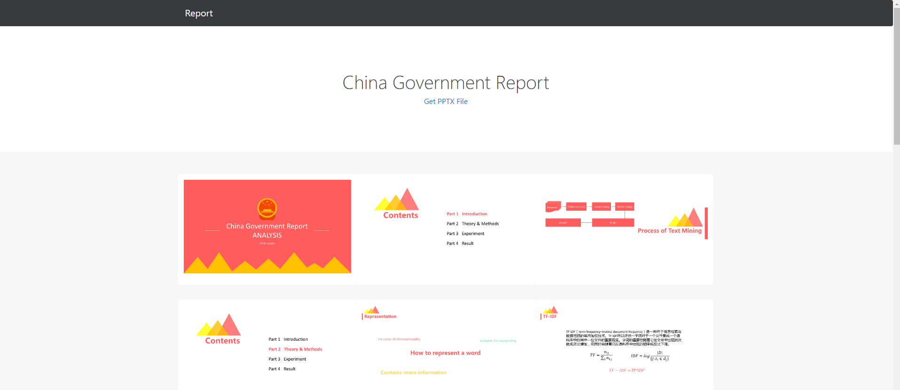
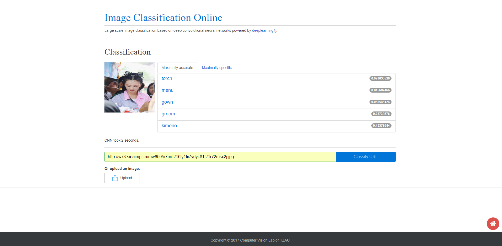

# XCloud in Java

## Introduction 

   This repository is a Java implementation of [XCloud](https://arxiv.org/pdf/1912.10344.pdf) which provides common AI services (computer vision, NLP, data mining and etc.) with RESTful APIs. It allows you to serve your machine learning models with few lines of code. The platform is developed and maintained by [@LucasX](https://github.com/lucasxlu) based on SSM (SpringMVC, Spring and MyBatis) and [DeepLearning4J](https://deeplearning4j.org/).
   
   
   
   
   
   
     
## Prerequisite
    
   To make use of this repository, you should have several softwares installed on your machine.
   1. JDK1.8 or higer
   2. [deeplearning4j](https://deeplearning4j.org/)
   3. Python3.X is required(Python3.5 or 3.6 is recommended)
   4. Maven support
   5. MySQL should be 5.7 or higher
   6. Tomcat 8 or higher (Ngix will also be fine)
   7. In order to handle with captcha, you should have [tessdata](https://github.com/tesseract-ocr/tessdata) directory in your project
   8. Compile OpenCV3.2, if you config this project in IntelliJ IDEA, you should set your VM Options as follows:
      > -Djava.library.path="D:\OpenCV3\opencv\build\java\x64"

## Third Party Library
    
   To make this repo works normally, you'd better have several 3rd party library installed on your machine
   1. [BeautifulSoup4](https://www.crummy.com/software/BeautifulSoup/bs4/doc/index.zh.html)
   2. [requests](http://www.python-requests.org/en/master/)
   3. [jieba](https://github.com/fxsjy/jieba/)
   
## Note 

   **XCloud in Java is no longer maintained, please refer to [XCloud in Python](https://github.com/lucasxlu/XCloud) to keep up with state-of-the-art models.**
